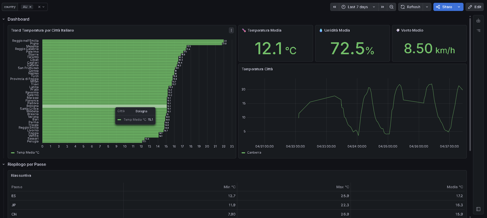
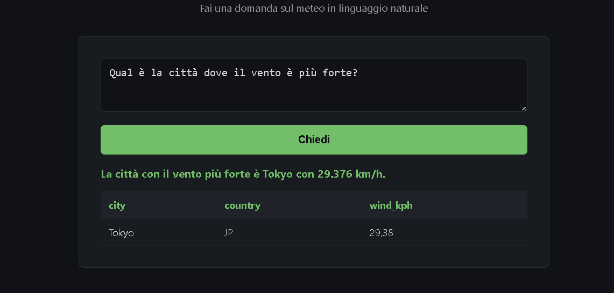

# 🌤 Weather Report Pipeline

End-to-end weather data pipeline with AI natural language interface,
running in production since April 2026.

## 📌 Overview

This project collects real-time weather data from **40+ cities worldwide**,
stores and transforms it through a multi-layer PostgreSQL database,
orchestrates the pipeline with Apache Airflow, visualizes it in Grafana,
and exposes a natural language query interface powered by OpenAI.

**By the numbers:**
- 🏙 40+ cities monitored (30 Italian cities + 10 world capitals)
- ⚡ Hourly automated runs via Apache Airflow
- 🔄 150+ pipeline executions (100 automated + 50 manual)
- 🗄 5,000+ rows collected across raw, staging and mart layers
- 📅 Running continuously since April 2026

## 📸 Screenshots

**Grafana Dashboard**


**AI Natural Language Interface**


## 🏗 Architecture
[OpenWeatherMap API]
↓
[Python Ingestion] → [PostgreSQL RAW layer]
↓
[Staging layer]
(data cleaning + parsing)
↓
[Mart layer - Star Schema]
┌────────────────────────┐
│  dim_location          │
│  dim_time              │
│  fact_weather          │
└────────────────────────┘
↓
┌───────────────┴───────────────┐
↓                               ↓
[Apache Airflow]               [Grafana Dashboard]
(hourly scheduler)             (interactive charts)

[Flask + OpenAI API]
(natural language query interface)

## 🗄 Data Model

The mart layer follows a **Star Schema** design for efficient querying
and analytics.
                    ┌─────────────────┐
                    │  dim_location   │
                    │─────────────────│
                    │ location_id  PK │
                    │ city            │
                    │ country         │
                    └────────┬────────┘
                             │
┌─────────────────┐  ┌───────┴──────────┐
│   dim_time      │  │   fact_weather   │
│─────────────────│  │──────────────────│
│ time_id      PK │──│ fact_id       PK │
│ full_timestamp  │  │ location_id   FK │
│ date            │  │ time_id       FK │
│ year            │  │ temperatura_c    │
│ month           │  │ wind_kph         │
│ day             │  │ humidity         │
│ hour            │  │ raw_id        FK │
└─────────────────┘  └──────────────────┘  

**Three database layers:**
- **RAW** — stores the original JSON response from the API, untouched
- **Staging** — parses and cleans the JSON into relational columns,
  converts wind speed from m/s to km/h, converts UNIX timestamp to TIMESTAMP
- **Mart** — star schema optimized for analytics and Grafana queries

## 🛠 Tech Stack

- **Python** — data ingestion, pipeline logic, Flask web server
- **PostgreSQL** — multi-layer database (raw → staging → mart)
- **Apache Airflow** — hourly pipeline automation with task monitoring
- **Grafana** — interactive dashboard with filters and drill-through
- **Flask** — lightweight web server for the AI interface
- **OpenAI API (gpt-4.1-mini)** — natural language to SQL (Text-to-SQL)

## ⚙️ Apache Airflow — Pipeline Orchestration

The pipeline is orchestrated by a DAG (`weather_pipeline`) with
two sequential tasks: [ingestion_raw] → [sql_trasformazioni]
- **ingestion_raw** — Python operator that calls the OpenWeatherMap API
  for all 40+ cities and saves raw JSON to PostgreSQL
- **sql_trasformazioni** — Python operator that runs the full SQL
  transformation chain: raw → staging → mart

**Schedule:** `0 * * * *` (every hour, automated)

**Production stats:**
- 42 total runs recorded
- 33 successful / 9 failed
- Mean run duration: 1 minute 51 seconds
- Max run duration: 5 minutes 46 seconds

The 9 failed runs are real production errors from early development,
kept intentionally to show an honest pipeline history.

## 🤖 AI Natural Language Interface

The most distinctive feature of this project: a **Text-to-SQL interface**
that lets anyone query the weather database in plain language,
without writing a single line of SQL.

**How it works:**
1. The user types a question in natural language (Italian or English)
2. The database schema is passed to OpenAI as context
3. OpenAI generates the corresponding SQL query
4. The query runs against PostgreSQL
5. Results are displayed in a formatted table

**Security:** only `SELECT` queries are allowed —
the system rejects any non-read SQL before execution.

**Example questions:**
- *"Which city has the highest temperature right now?"*
- *"Which city has the strongest wind?"*
- *"Show me the average humidity by country"*
- *"What was the coldest city yesterday at 3pm?"*

## 📊 Grafana Dashboard

- Temperature trends across all monitored Italian cities
- Hourly temperature, humidity and wind charts per city
- Country-level summary table (min, max, avg temperature)
- Interactive filters by country and city
- Drill-through from summary to city-level detail

## 📁 Project Structure
weather-report/
├── config/         # environment variables and city list
├── db/             # database connection and SQL runner
├── ingest/         # OpenWeatherMap API ingestion
├── llm/            # Flask app and OpenAI integration
│   └── templates/  # HTML interface
├── sql/
│   ├── staging/    # raw → staging transformations
│   └── mart/       # staging → star schema
├── main.py         # pipeline entry point
└── requirements.txt

## ⚙️ Setup

1. Clone the repository
```bash
git clone https://github.com/robertotommasogrossi7-bit/weather-report.git
cd weather-report
```

2. Create and activate virtual environment
```bash
python -m venv venv
venv\Scripts\activate  # Windows
```

3. Install dependencies
```bash
pip install -r requirements.txt
```

4. Create a `.env` file in the root with your credentials
DB_HOST=your_host
DB_PORT=5432
DB_NAME=your_db
DB_USER=your_user
DB_PASSWORD=your_password
WEATHER_API_KEY=your_openweathermap_key
OPENAI_API_KEY=your_openai_key

5. Run the pipeline
```bash
python main.py
```

6. Run the AI interface
```bash
python -m llm.app
```
Then open `http://localhost:5000`

## 📝 Notes

- The `.env` file is excluded from the repository.
  Never commit API keys to version control.
- The pipeline requires a running PostgreSQL instance
  and Apache Airflow configured locally.

## ⚠️ Engineering Notes

- The pipeline uses **ELT** (SQL transformations) instead of heavy Python logic
- Raw data is stored as **JSONB** for flexibility and schema evolution
- Airflow manages scheduling and retries
- Some failed DAG runs are intentionally preserved to demonstrate
  real debugging scenarios in a production environment

## 🚀 Future Improvements

- Logging system (pipeline observability)
- Data quality checks (validation layer)
- Deployment (Docker / cloud)
- Query caching for LLM responses

## 📄 License

MIT License — see [LICENSE](LICENSE) for details.
